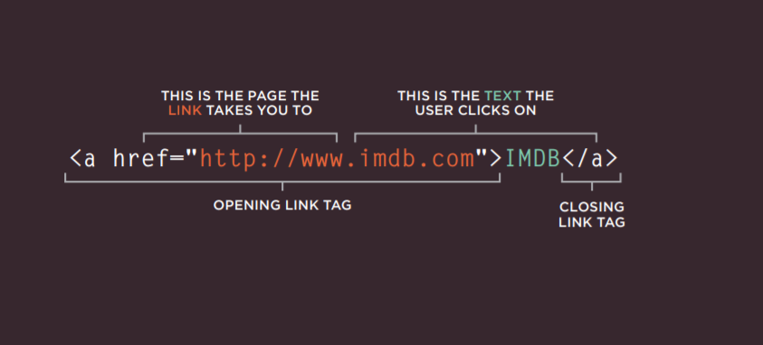
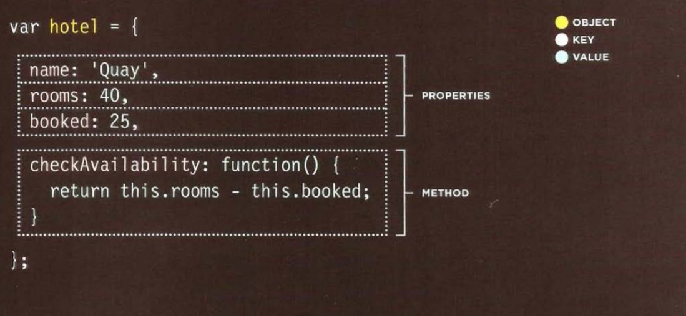

# How to add a link to your HTML?
 as simple as it is HTML always have a tag for every thing just add the `<a>` tag and add the  URL t the `hrrf`and you 'll get the link on your web page , to add it attached to a specific word of statement on your page you can add the text between `<a>` tags.

 
you can use links to connect your page into other pages or to collect relative pages together or even using `mailto:`befor your own email in order to make user contact you directly via your email.

# How to layout elements by CSS?
CSS treats each HTML element as if it is in its own box. This box will either be a block-level box or an inline box,If one block-level element sits inside another block-level element then the outer box is known as the containing or parent element.

**controlling element's position**
CSS has the following positioning schemes that allow you to control
the layout of a page: normal flow, relative positioning, and absolute
positioning. You specify the positioning scheme using the position
property in CSS. You can also float elements using the float propertyTo indicate where a box should be positioned, you may also need to use
box offset properties to tell the browser how far from the top or bottom
and left or right it should be placed

# functions :
Functions are building blocks in JavaScript. A function in JavaScript is similar to a procedure—a set of statements that performs a task or calculates a value, To use a function, you must define it somewhere in the scope from which you wish to call it.
declaring function :
* The name of the function.
* A list of parameters to the function, enclosed in parentheses and separated by commas.
* The JavaScript statements that define the function, enclosed in curly brackets.

# Literal National to create an object:
Objects in JavaScript, can be compared to objects in real life,each one has its properties and type .

