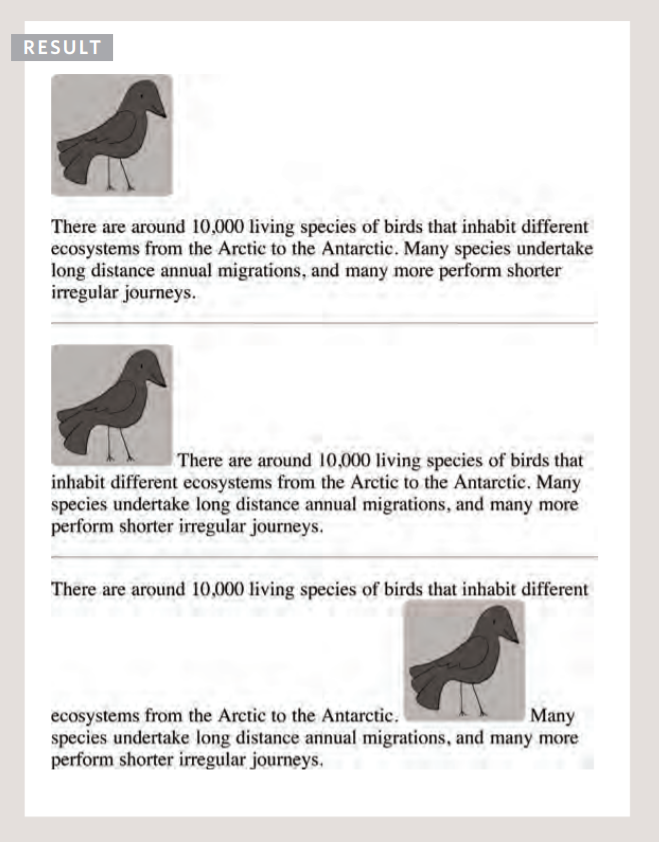
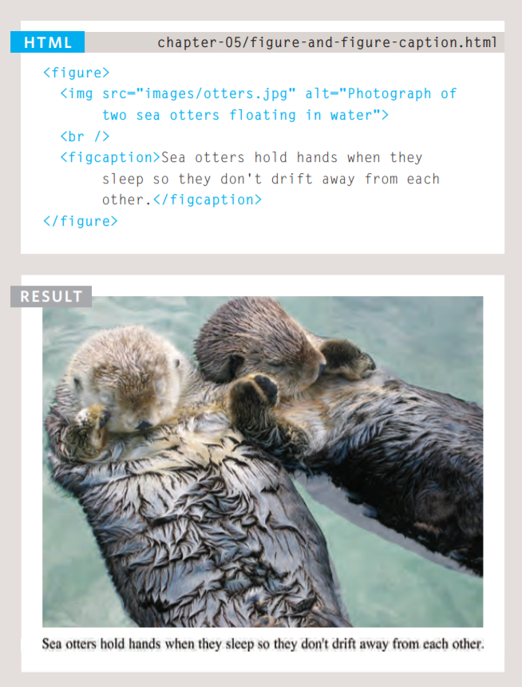

# Iages how to add and designe the page with images?
by using self closed `` tag in html you can  have an image any where in yourweb page inside a paragraph or before it or even in the beginning of it and for each position the image will take a different appearance and disigning , could treat it as inline element or block elemnt but basicly iages are inline elemnts.

The images you use on your website should be saved at the same width and height that you want them to appear on the page,also when you crop an image try to have a convenient space inside image in order not to lose any information Images created for the web should be saved at a resolution of 72 pp,and the most affected images withresolution difference are vector image so you should take care for those.

To create an image that is partially transparent it involves
selecting one of two formats PNG or transparent GIF
 `<figure>` and `<figcaption>` are HTML5 features added to have image with added caption.
 

 # Colors , How tospecify and the use of background ccolors:

 Every color on a computer screen is created by mixing amounts of red,
green, and blue different methodes to define colors :
* RGB Values Values for red, green, and blue are expressed as numbers between 0 and 255,rgb(102,205,170)
*  Hex Codes represent values for red, green, and blue in
hexadecimal code,#66cdaa;
* Color Names.Colors are represented by predefined names,white.
* Hue is near to the colloquial idea of color. Technically speaking however, a color can also have saturation and brightness as well as hue.
* HSL colors ,provided by CSS3 and it's a combination of HAU , Saturation and Lightness.
 

 # Texts, align and design:
 
 when dealing with texts we  usually have to choose a type face ,When choosing a typeface, it is important to understand that a browser will usually only display it if it's installed on that user's computer.
 and below an example of a typeface
 
 